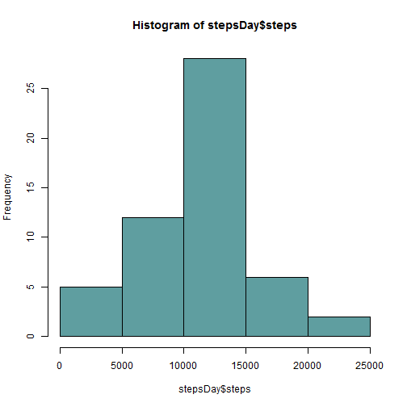

# Reproducible Research: Peer Assessment 1

## Loading and preprocessing the data

```r
unzip("activity.zip")  #unzip
activity <- read.csv("activity.csv")  #read
activity$date <- as.Date(activity$date)
```


## What is mean total number of steps taken per day?

1- Histogram of the total number of steps taken each day

```r
stepsDay <- aggregate(steps ~ date, activity, sum)
hist(stepsDay$steps, col = "cadetblue")
```

 

2- Calculation of the mean and median total number of steps taken per day

```r
mean(stepsDay$steps, na.rm = T)  #mean Day
```

```
## [1] 10766
```

```r
median(stepsDay$steps)  # median Day
```

```
## [1] 10765
```


## What is the average daily activity pattern?
1- Time series plot of the 5-minute interval (x-axis) and the average number of steps taken, averaged across all days

```r
stepsInterval <- aggregate(steps ~ interval, activity, mean, na.rm = T)
plot(stepsInterval, type = "l", col = "blue", lwd = 2, ylab = "number of steps")
```

 

2- The 5-minute interval that has the maximum number of steps (averaged across all days in the dataset) is:

```r
stepsInterval$interval[which.max(stepsInterval$steps)]  #maxStepsInterval
```

```
## [1] 835
```


## Imputing missing values
1- Total number of missing values in the dataset:

```r
sum(is.na(activity$steps))  # missing values (steps) in dataset
```

```
## [1] 2304
```

2- My imputing strategy will be to replace the NA values with mean for day-of-the-week + interval (e.g. I am likely to repeat my steps similarly across all Mondays).

3- To create the dataset I aggregated by interval and by day of the week using the **weekends()** function, and by interval, then I created a key column on the original and aggregation dataframes, merged them and substituted the NAs for the corresponding average per weekday and interval.

```r
activityI <- activity  # do the imputing operations on a new data frame
activityI$weekday <- weekdays(activityI$date)
stpsIntvWday <- aggregate(steps ~ interval + weekday, activityI, mean, na.rm = T)
activityI$merger <- with(activityI, paste0(weekday, as.character(interval)))
stpsIntvWday$merger <- with(stpsIntvWday, paste0(weekday, as.character(interval)))
# merge operation
activityI <- merge(activityI, stpsIntvWday, by = "merger", suffixes = c("", 
    ".y"))
# cleaning operation
nal <- is.na(activityI$steps)
activityI$steps[nal] <- activityI$steps.y[nal]
activityI <- activityI[, 2:4]
activityI <- activityI[with(activityI, order(-as.numeric(date), interval)), 
    ]
row.names(activityI) <- NULL  #I hate the row.names column
```

4- Histogram of the total number of steps taken each day for imputed dataset

```r
stepsDayI <- aggregate(steps ~ date, activityI, sum)
hist(stepsDayI$steps, col = "darkgoldenrod")
```

 

Mean and Median of total number of steps taken per day for imputed dataset

```r
mean(stepsDayI$steps, na.rm = T)  #mean Day
```

```
## [1] 10821
```

```r
median(stepsDayI$steps)  # median Day
```

```
## [1] 11015
```

The values for Mean and Median do change, in both cases the are higher than for the original dataset. This is the result of the imputing strategy using both weekday AND interval.


## Are there differences in activity patterns between weekdays and weekends?
1- New factor variable with "weekday" and "weekend" levels indicating whether a given date is a weekend or weekday, and then use this factor to *split* the dataset

```r
weekendList <- c("Saturday", "Sunday")
dayLabel <- c("weekday", "weekend")
activityI$dayGroup <- with(activityI, factor(weekdays(date) %in% weekendList, 
    labels = dayLabel))
activityW <- split(activityI, activityI$dayGroup, drop = T)
```

2- Calculation of means for intervals for weekdays/weekends categorical variable, and plotting of both in a panel

```r
# calculate means for intervals for weekdays and weekends separatelly
aggrStepsInterval <- function(df) {
    aggregate(steps ~ interval, df, mean, na.rm = T)
}
stepsIntervalW <- lapply(activityW, aggrStepsInterval)

# plot means for intervals for weekdays and weekends
par(mfrow = c(2, 1), mar = c(4.1, 4.5, 2, 2))
plot(stepsIntervalW[[1]], type = "l", main = "Weekdays", col = "blue", lwd = 2, 
    ylab = "number of steps")
plot(stepsIntervalW[[2]], type = "l", main = "Weekends", col = "red", lwd = 2, 
    ylab = "number of steps")
```

 

The activity patterns for the weekdays and weekends are different. Here are some differences:
* People seem to wake up later during the weekends
* Weekdays have an initial burst of activity, and slow down considerably during the day
* Weekdns seem to have a relatively sustained level of activity during the day
